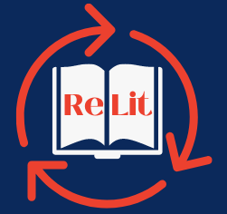
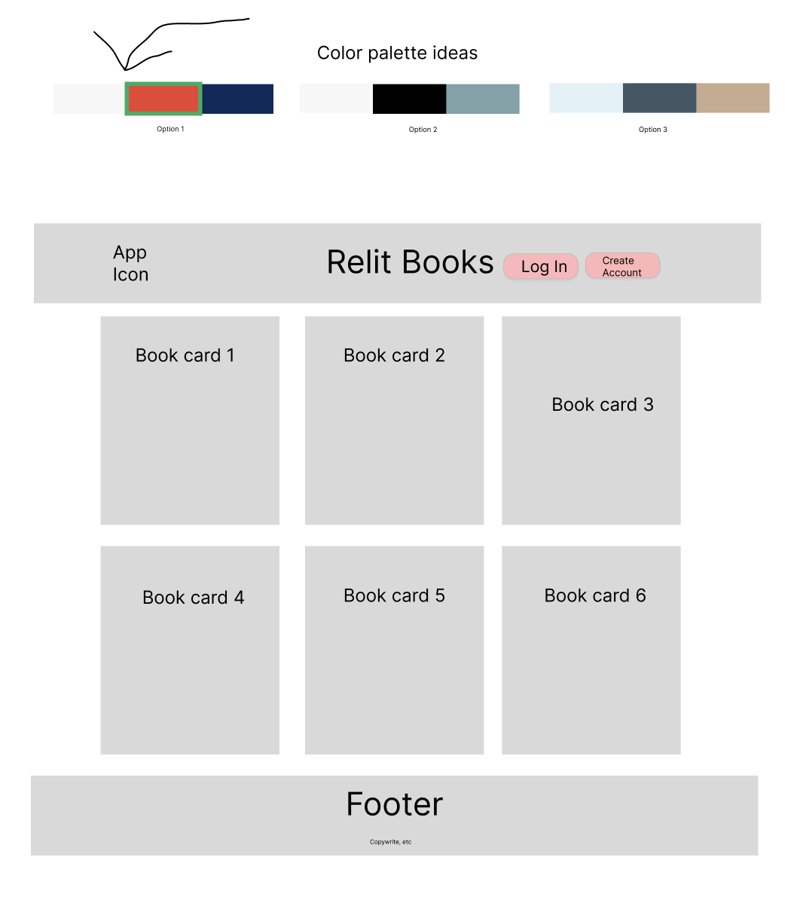
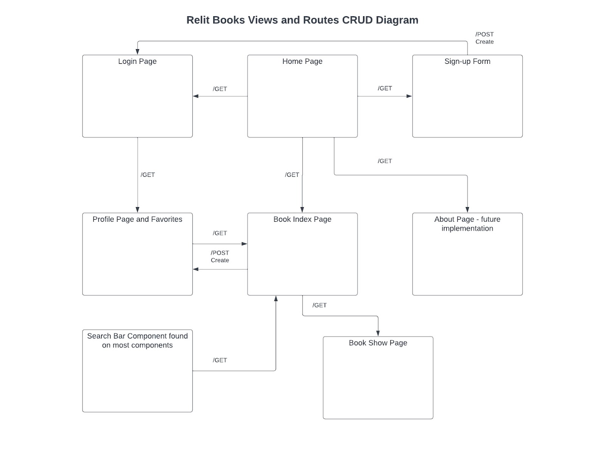

 
 <h2 align="center">Relit Books</h2>

# Relit Books
ReLit is your go-to book sharing application. Search for your favorite books, add them to    your profile, and share the books you have read and loved with others.

## ✨ Requirements
* Any Operating System (ie. MacOS X, Linux, Windows)
* Internet Browser (ie. Google Chrome)
* Source Code Editor (ie. VSCode)
* PostgreSQL
* npm (use npm run dev to intialize the project)

# Project Plan
- ✨ Overall idea
    * Book API- Book sharing 
      * Home Page: Sign-up Form, Login Page
         - Book Index Page 
         - Book Show Page
         - About Page (Future Implementation)
      * Sign-up Form/Login Page:
         - Profile Page and Favorites
         - Search Bar Component found on most components     
- ✨ Name: Relit Books
- ✨ Design/look
   * Font:  BlackMango (Font in logo, from Canva)
   * Colors: (https://mycolor.space/?hex=%23845EC2&sub=1)

 <h2 align="center">Color Palette Ideas using Material UI</h2>

   

## Project Wireframe/Structure:

 <h2 align="center">Relit Books Database Table Relationships</h2>
 

 <h2 align="center">Relit Books Views and Routes CRUD Diagram</h2>

---
### :hammer_and_wrench: Languages and Tools :
- ✨ Front-end: React, MaterialUI
- ✨ Back-end: Express, Node.js, Postgres
    - Packages: Express, NodeJS
    
- ✨ Database: PostgreSQL

## ✨ Future Tasks✨
 - Convert into TypeScript
 - Use SASS for styling
 - Adding more Web Accessibilty features

## 👤 Author(s)

* Brenton Ring: [@brentonring](https://github.com/brentonring)
* Marisol Rodriguez: [@marisoldrodriguez](https://github.com/marisoldrodriguez)
* Katie Eells: [@kleells](https://github.com/kleells)
* Eric Lowe: [@ericlowe25](https://github.com/ericlowe25)

## 📝 License
MIT License

Copyright (c) 2022 Brenton Ring

Permission is hereby granted, free of charge, to any person obtaining a copy
of this software and associated documentation files (the "Software"), to deal
in the Software without restriction, including without limitation the rights
to use, copy, modify, merge, publish, distribute, sublicense, and/or sell
copies of the Software, and to permit persons to whom the Software is
furnished to do so, subject to the following conditions:

The above copyright notice and this permission notice shall be included in all
copies or substantial portions of the Software.

THE SOFTWARE IS PROVIDED "AS IS", WITHOUT WARRANTY OF ANY KIND, EXPRESS OR
IMPLIED, INCLUDING BUT NOT LIMITED TO THE WARRANTIES OF MERCHANTABILITY,
FITNESS FOR A PARTICULAR PURPOSE AND NONINFRINGEMENT. IN NO EVENT SHALL THE
AUTHORS OR COPYRIGHT HOLDERS BE LIABLE FOR ANY CLAIM, DAMAGES OR OTHER
LIABILITY, WHETHER IN AN ACTION OF CONTRACT, TORT OR OTHERWISE, ARISING FROM,
OUT OF OR IN CONNECTION WITH THE SOFTWARE OR THE USE OR OTHER DEALINGS IN THE
SOFTWARE.
